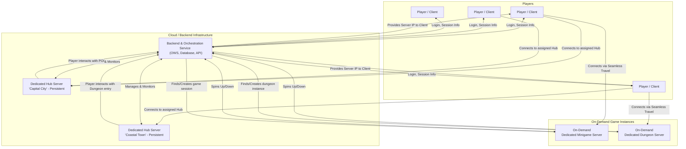

# Technical Design Document: Multiplayer Server Architecture

*   **Version:** 1.3
*   **Date:** July 17, 2025
*   **Author:** [Your Name/Studio Name]
*   **Changes:** v1.3 adds a blank line after the Mermaid diagram code block to fix markdown parsing errors.

## 1. Overview & Document Purpose

This document outlines the technical design for a scalable and cost-effective multiplayer server architecture for a game developed in Unreal Engine 5. The design prioritizes a seamless player experience, transitioning between persistent open-world hubs and instanced gameplay modes like minigames and dungeons.

The primary goal is to create a robust system that can be managed by a solo developer, with a strong emphasis on minimizing operational costs during development and initial launch phases.

## 2. Core Architectural Goals

*   **Seamless Player Experience:** Players should be able to move from large social hubs to instanced activities (minigames, dungeons) with minimal loading or friction.
*   **Cost-Effectiveness:** The architecture must be designed to minimize server costs, primarily by launching dedicated servers on-demand rather than maintaining a large fleet of idle servers.
*   **Scalability:** The system should be capable of scaling horizontally, supporting multiple hub worlds and a growing number of concurrent minigames as the player base expands.
*   **Living World Feel:** The hub worlds should feel dynamic. Players should be able to see "Points of Interest" (POIs) for active game sessions and join them directly from the world.
*   **Maintainability:** As a solo developer project, the system should leverage powerful existing tools (like OWS) to reduce development overhead.

## 3. System Architecture Diagram

## 4. Component Breakdown

#### 4.1. Player / Client
*   **Description:** The Unreal Engine 5 game application running on the player's machine. It is responsible for rendering the world, handling input, and communicating with the game servers. It will never act as a host.

#### 4.2. Backend & Orchestration Service (OWS)
*   **Description:** This is the central brain of the entire system, powered by **Open World Server (OWS)**. It is not a single server but a collection of backend services.
*   **Responsibilities:**
    *   **Player Authentication:** Handles player login and account data persistence (via the database).
    *   **Session Management:** Tracks which player is on which server at all times.
    *   **Server Orchestration:** The most critical feature for cost management. It is responsible for launching new dedicated server instances (`Minigame` or `Dungeon`) when needed and terminating them when they are empty.
    *   **Matchmaking & POI Data:** Maintains a list of all active minigame and dungeon instances. Hub servers query this service to display the Points of Interest (POIs).

#### 4.3. Dedicated Hub Server(s)
*   **Description:** Persistent, always-on dedicated servers that host the large open-world town/city maps. There will be multiple hubs to distribute player load and provide varied environments.
*   **Technology:** These maps will be built using **World Partition** for efficient streaming of large environments.
*   **Function:** Players will load into these hubs after logging in. They serve as social spaces where players can interact, form parties, and discover activities via the POI system.

#### 4.4. On-Demand Dedicated Servers
*   **Description:** These are non-persistent, ephemeral dedicated server instances for minigames and dungeons.
*   **Lifecycle:**
    1.  The OWS orchestrator launches a new instance when a player or party requests to start a new activity.
    2.  The server runs the specific map (e.g., `MAP_SnowballFight` or `MAP_Dungeon_Level1`).
    3.  Players connect and play the instance.
    4.  Once the last player leaves, the server reports back to OWS and shuts down, **ceasing all hosting costs**.
*   **Benefit:** This model directly addresses the cost concern. A minigame requiring 16 players is feasible because the dedicated server only exists for the duration of that match. You are not paying for it to sit idle.

## 5. Key Gameplay Flows

#### 5.1. Player Login and Hub Entry
1.  Player launches the client and enters credentials.
2.  Client sends credentials to the **OWS** authentication service.
3.  OWS validates the credentials against its database and returns a session ticket.
4.  OWS determines the appropriate **Hub Server** for the player (based on location, party, or server load) and provides its IP address to the client.
5.  The client connects to the assigned Hub Server, and the player spawns in the city/town.

#### 5.2. Joining a Minigame (Seamless Travel)
1.  While on a **Hub Server**, the player approaches a POI (e.g., a snowball fight arena).
2.  The Hub Server queries **OWS** to get real-time data about active "Snowball Fight" instances (e.g., player count, slots available). This data is displayed to the player. The idea of showing NPCs fighting in a full instance is a client-side visual representation.
3.  The player chooses to join a match with an open slot.
4.  The client sends a "Join Request" to **OWS**.
5.  OWS either finds an existing match with space or (if none exist) orchestrates the launch of a new **On-Demand Minigame Server**.
6.  OWS provides the IP address of the target minigame server directly to the client.
7.  The client initiates a **Seamless Server Travel** to the new IP address. A temporary loading/transition map is used to maintain the connection and provide a smooth experience.
8.  The player is now connected to the minigame server and disconnected from the hub. The process is reversed upon minigame completion.

## 6. Technology Stack & Rationale

*   **Engine:** Unreal Engine 5.6
*   **World Management:** World Partition
*   **Server Orchestration:** Open World Server (OWS) by SabreDart Studios
*   **Hosting Strategy:** Phased Cloud Deployment

## 7. Feasibility and Risk Assessment

*   **Overall Feasibility:** **High.**
*   **Risks & Mitigations:**
    *   **Risk:** **Cost Overruns.**
        *   **Mitigation:** Implement strict server lifetime policies in OWS. Use cloud provider budget alerts. Utilize Spot Instances for interruptible workloads.
    *   **Risk:** **Complexity of OWS Setup.**
        *   **Mitigation:** Dedicate initial development time to understanding the OWS framework. Follow documentation and community resources.
    *   **Risk:** **Seamless Travel Polish.**
        *   **Mitigation:** Carry over essential player state during travel. Use well-designed, lightweight transition levels. Iterate on the implementation.