# Evil Forces - System Diagrams

This document contains Mermaid diagrams that visualize the various systems and architecture of Evil Forces.

## 1. Game Architecture Overview


## 2. Player Progression Flow


## 3. Minigame Systems Integration

```mermaid
graph LR
    subgraph "Adventure Zones"
        HV[Haunted Village<br/>Souls]
        DC[Dark Carnival<br/>Haunted Candy]
        CL[Candy Land<br/>Sweet Materials]
    end
    
    subgraph "Crafting Systems"
        FC[Food Crafting<br/>Monsters]
        RC[Robot Crafting<br/>Mechs]
        GC[General Crafting<br/>Equipment]
    end
    
    subgraph "Minigames"
        FF[Food Fighters<br/>Pokémon-style Combat]
        RF[Robot Fighters<br/>Mech Combat]
        SF[Snowball Fight<br/>Seasonal]
        FA[Fort Attack<br/>Base Building]
    end
    
    HV --> FC
    DC --> FC
    CL --> FC
    
    HV --> RC
    DC --> RC
    CL --> RC
    
    FC --> FF
    RC --> RF
    
    GC --> SF
    GC --> FA
    
    style FF fill:#e8f5e8
    style RF fill:#e8f5e8
    style FC fill:#fff3e0
    style RC fill:#fff3e0
```



## 4. Character Archetype System


## 5. Social & Housing Systems


## 6. Economy & Progression Systems


## 7. World Events & Dynamic Content

```mermaid
graph TD
    subgraph "Local Events"
        Snowball[Snowball Fight<br/>Seasonal Competition]
        MarketSale[Market Sale<br/>Limited-time Discounts]
        Festival[Festival<br/>Themed Celebrations]
    end
    
    subgraph "Global Events"
        ThreatEvent[Threat Event<br/>"Necromancer in 5 days"]
        Discovery[Discovery Event<br/>New Areas Appear]
        Community[Community Challenge<br/>Server-wide Goals]
    end
    
    subgraph "Event Triggers"
        Time[Time-based<br/>Scheduled Events]
        PlayerAction[Player Actions<br/>Community Milestones]
        ServerState[Server State<br/>Population/Activity]
        Random[Random<br/>Unexpected Events]
    end
    
    Time --> Snowball
    Time --> MarketSale
    Time --> Festival
    
    PlayerAction --> ThreatEvent
    ServerState --> Discovery
    Random --> Community
    
    style ThreatEvent fill:#ffcdd2
    style Discovery fill:#c8e6c9
    style Community fill:#bbdefb
```

## 8. Quest & Mission Flow


## 9. Technical Performance Requirements


## 10. Development Pipeline


These diagrams provide visual representations of the key systems and relationships in Evil Forces. They can be used for:

1. **Team Communication:** Clear visualization of system interactions
2. **Development Planning:** Understanding dependencies and requirements
3. **Documentation:** Visual aids for technical and design documentation
4. **Stakeholder Presentations:** Easy-to-understand system overviews
5. **Onboarding:** New team member orientation and understanding

The diagrams can be updated as the design evolves and new systems are added to the game. 